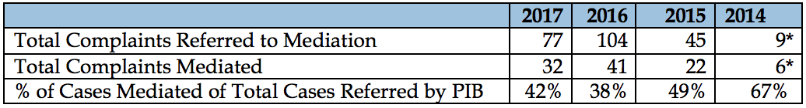
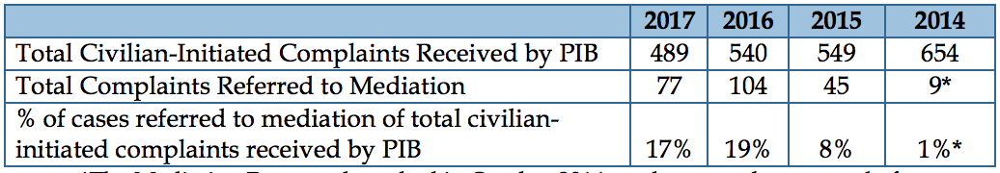
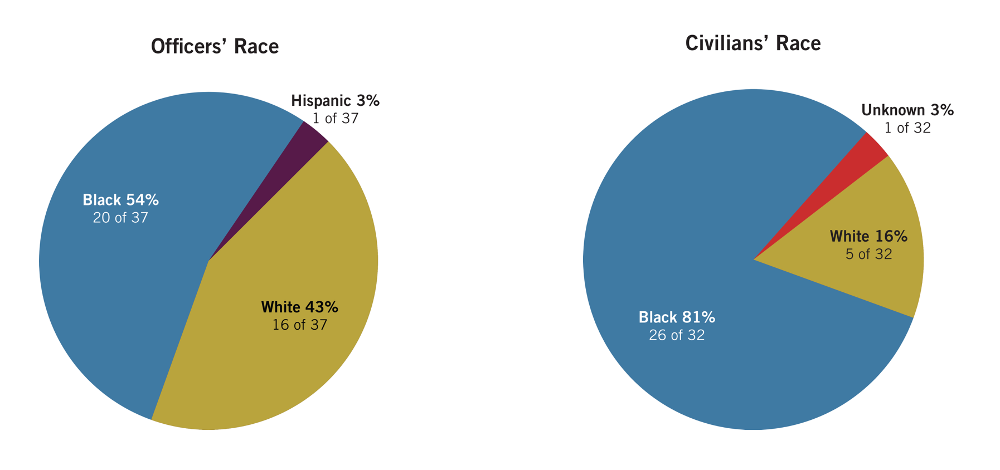
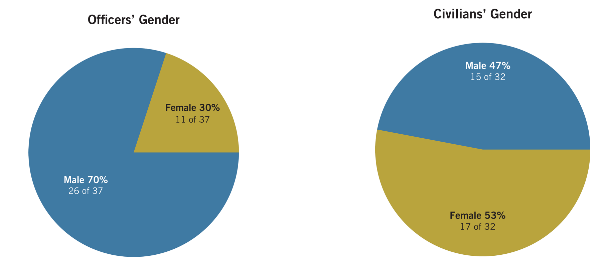
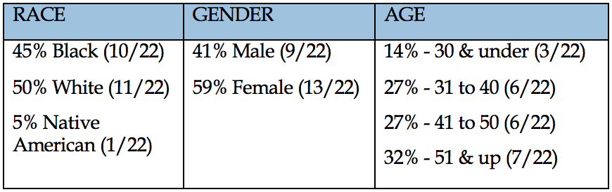
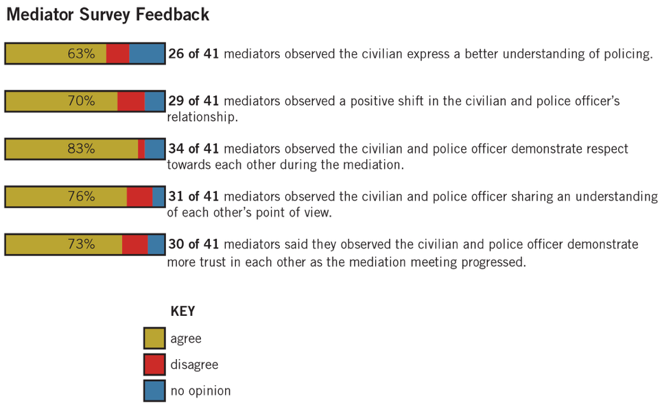
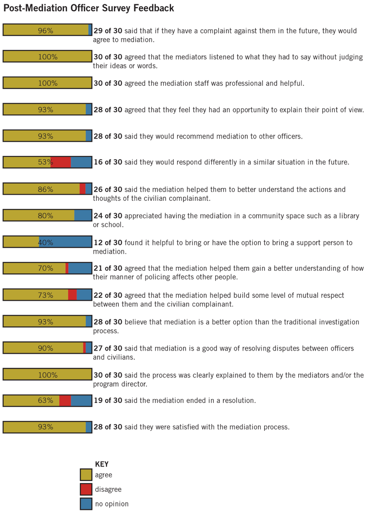
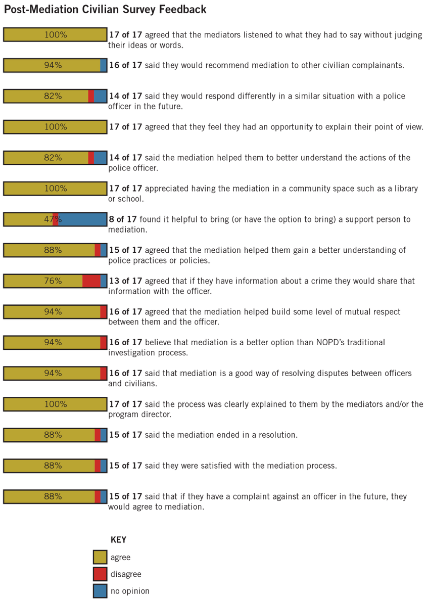

```{r setup, echo = FALSE, cache = FALSE, include = FALSE}
library(flexdashboard)
source("annual_report_2017.R")

# Force
source("analysis/force/force_by_year.R")
source("analysis/force/force_by_month.R")
source("analysis/force/uof_by_type.R")
source("analysis/force/uof_by_reason.R")
source("analysis/force/uof_by_level_and_year.R")
source("analysis/force/uof_pies_each_type.R")
source("analysis/force/uof_by_effectiveness.R")
source("analysis/force/uof_by_district_level.R")
source("analysis/force/uof_by_disposition.R")
source("analysis/force/uof_by_officer_age_exp.R")
source("analysis/force/force_per_officer.R")
source("analysis/force/uof_by_victim_sex_race.R")
source("analysis/force/uof_by_officer_sex_race.R")
source("analysis/force/uof_by_injury.R")
source("analysis/force/uof_against_blacks_comparison.R")

# Officers
source("analysis/officers/officer_demographics.R")
source("analysis/officers/officer_zips.R")

# Allegations
source("analysis/complaints/complaints_allegations_by_year.R")
source("analysis/complaints/complaints_allegations_by_month.R")
source("analysis/complaints/allegations_by_type.R")
source("analysis/complaints/top_allegations.R")
source("analysis/complaints/complaints_by_outcome.R")
source("analysis/complaints/complaints_allegation_sex_race_disposition.R")
source("analysis/complaints/complaints_by_disposition_officer_race.R")
source("analysis/complaints/allegations_by_source.R")
source("analysis/complaints/complaints_by_rank_disposition.R")
source("analysis/complaints/complaints_anonymous.R")
source("analysis/complaints/allegations_fourth_amendment.R")
source("analysis/complaints/allegations_retaliation.R")
source("analysis/complaints/allegations_mediation.R")
source("analysis/caselist.R")

# Actions taken
source("analysis/complaints/actions_taken_by_action.R")
source("analysis/complaints/discipline_by_allegation.R")
source("analysis/complaints/discipline_by_public_sex.R")
source("analysis/complaints/discipline_by_race.R")

# Outreach
source("analysis/oipm_survey.R")

# BWC
source("analysis/bwc/bwc.R")
```

Introduction {data-orientation=columns}
===================================== 

Column
-------------------------------------

### ATTENTION: THIS IS A DRAFT!

#### WORK IN PROGRESS
OIPM's 2017 annual report is currently a work in progress. All analysis and data contained on this website should not be relied on until the official report is
released. 


#### NOT MOBILE FRIENDLY
For the best experience, view this website on a desktop computer using full-screen.


### Navigating the report
This website is an interactive version of the statiscal analysis from OIPM's 2017 annual report Annual Report. Analysis is divided into these sections:

1. [Data Sources](#data-sources)
2. [Use of Force](#use-of-force)
3. [Complaints & Discipline](#complaints)
4. [Officer Demographics](#officers)
5. [Community outreach](#community-outreach)
6. [Body-worn camera adherence](#bodyworn-cameras)

Column
-------------------------------------
### Reproducing this report

#### tl;dr
```
git clone https://github.com/marvinmarnold/oipm_annual_report
# Install pre-requisites
Rscript run.R
```

#### Source
The data and scripts used to generate this website are available [here](https://github.com/marvinmarnold/oipm_annual_report).

#### Pre-requiites: Installing on Ubuntu 16.04

```
# Dependencies
sudo add-apt-repository -y ppa:opencpu/jq
sudo add-apt-repository -y ppa:ubuntugis/ppa
sudo apt-get update
sudo apt-get install r-base-dev r-base-core libjq-dev libcurl4-openssl-dev libssl-dev libprotobuf-dev libjq-dev libv8-3.14-dev protobuf-compiler libgdal1-dev libgdal1i libproj-dev libudunits2-dev gdal-bin python-gdal python3-gdal libgstreamer-plugins-base0.10-0 libgstreamer0.10-0

# Install pandoc 2 from http://pandoc.org/installing.html#linux

# Get newest versions 
install.packages('devtools')
library(devtools)
devtools::install_github('hadley/ggplot2')
devtools::install_github("hrecht/censusapi")
devtools::install_github('rstudio/leaflet')

# Get stable releases
install.packages(c("dplyr", "tidyr", "ggplot2", "rmarkdown", "plotly", "flexdashboard", "maps", "pandoc", "leaflet", "maptools", "geojsonio"))
```

#### Dependencies
The report was written in Rmarkdown using Rstudio and has the following dependencies that can be installed using `install.packages("LIBRARY_NAME")`:

- dplyr
- tidyr
- ggplot2
- rmarkdown
- flexdashboard
- plotly
- pandoc (read troubleshooting notes)
- maps
- devtools::install_github('rstudio/leaflet')
- geojsonio (on ubuntu, installation fails many times and instructs to install dependencies)

#### Build and run
Once you have all the dependencies installed, you can clone the repository and use Knit in Rstudio to compile `index.Rmd`
in the project's root.

#### Troubleshooting

##### Pandoc
If you have trouble with Pandoc on Linux, check out [these instructions](https://github.com/rstudio/rmarkdown/blob/master/PANDOC.md#newer-systems-debianubuntufedora).

##### geojsonio
sudo apt-get install r-base-dev r-base-core libjq-dev libcurl4-openssl-dev libssl-dev libprotobuf-dev libjq-dev libv8-3.14-dev protobuf-compiler

sudo add-apt-repository -y ppa:opencpu/jq
  sudo apt-get update
  sudo apt-get install libjq-dev libv8-3.14-dev
  
`sudo apt install libgdal1-dev libgdal1i libproj-dev libudunits2-dev` then `install.packages("rgdal", repos = "http://cran.us.r-project.org", type = "source")`. You'll probably also need to update your gdal version:

https://stackoverflow.com/questions/37294127/python-gdal-2-1-installation-on-ubuntu-16-04#41613466

Then finally: `install.packages("geojsonio")`

#### Resources
If you want to get map data for other states, check out: https://github.com/jgoodall/us-maps then convert with ogre.adc4gis.com.
Use the entire ZIP that you download, when converting, don't need to extract. (Alternative = https://github.com/OpenDataDE/State-zip-code-GeoJSON)

LA zip codes http://download.geonames.org/export/zip/

Data sources {data-orientation=rows}
===================================== 

Row 
-------------------------------------
### Repo includes all data
Clone this repo to download all data. Alternatively, use the links to download each individually.

Row 
-------------------------------------
### Active duty officers
The IAPro DB that OIPM has access to contains officer information that is not always in a useable form or up-to-date.
For the official count of active NOPD officers in 2017, we use data provided by NOPD. But for providing information about
officers involved in specific uses of force or complaints, we use information from the IAPro DB.

#### Info about officers related to each incident
- Download: TODO
- Source: OIPM direct DB access on May 18, 2018
- Issue: Does not have reliable dates of employment

#### Official count of all active duty officers in 2017
- Download: TODO
- Source: NOPD pull from ADP on May 11, 2018
- Issue: Can't cross reference with IAPro data
- Issue: Need an independent way to access this information
- Issue: Need rank over time

Row 
-------------------------------------
### Use of Force
2017 is the first year that OIPM has independent access to a copy of the database that contains force information.
We have used the data on data.nola.gov to compare with NOPD's version and cross reference with previously reported numbers.
We are unable to reproduce all of NOPD's previous figures, especially for 2015 where there is a large discrepancy.

#### Direct database access
- Download: TODO
- Source: OIPM direct DB access on May 18, 2016
- Issue: 2015 data mostly missing. 
- Issue: Was arrested field does not appear to be reliable.

#### data.nola.gov
- Download: TODO
- Issues: Does not contain a unique way to identify officers.

Row 
-------------------------------------
### Complaints

- Issue: How to identify anonymous complaints
- Issue: How to identify 4th amendment violations.
- Issue: Many things OIPM believes to be illigitimate outcomes.
- Issue: Identifying complaints made by an officer.

More coming soon

Row 
-------------------------------------
### Bodyworn cameras
Coming soon

Row 
-------------------------------------
### Community outreach
Coming soon

Row 
-------------------------------------
### Arrest

- Issue: NOPD should not have to rely on OPSO for arrest data

More coming soon


Use of force {data-orientation=rows}
===================================== 

Row 
-------------------------------------
### ATTENTION: THIS IS A DRAFT!
OIPM's 2017 annual report is currently a work in progress. All analysis and data contained on this website should not be relied on until the official report is
released. 

**WORK IN PROGRESS**

**NOT MOBILE FRIENDLY**
For the best experience, view this website on a desktop computer using full-screen.


### Police districts
```{r fig.width = 6, fig.height = 6}
p.police.districts
```

Row 
-------------------------------------
### FTN vs UOF
FTN stands for “force tracking number”. It is the designation given to track the entirety
of an interaction between NOPD and one or more individuals wherein force was used.

A single FTN corresponds to one or more UOF. If Officer A and Officer B both use their
hands against Individual C, the result would be one FTN, corresponding to two UOFs
(one for each officer). The same pattern would apply if there were multiple types of
force used or multiple individuals that force was used on.

This report will always clearly label whether FTN or UOF is being used for a particular
analysis but the onus is on the reader to remain vigilant of the distinction.

Row {data-height=300}
-------------------------------------
### Analysis
**Force by year**
Coming soon

**Force by month**
Coming soon

Row 
-------------------------------------
### Use of force by year
```{r force.by.year, fig.width = 10, fig.height = 6}
p.force.by.year
```

### FTN & UOF in 2017 by month
```{r, fig.width = 10, fig.height = 6}
p.force.by.month
```

Row {data-height=300}
-------------------------------------
### Analysis
Coming soon

Row
-------------------------------------
### Level 1
```{r, fig.height = 3}
p.lvl.by.year[[1]]
```

### Level 2
```{r, fig.height = 3}
p.lvl.by.year[[2]]
```

### Level 3
```{r, fig.height = 3}
p.lvl.by.year[[3]]
```

### Level 4
```{r, fig.height = 3}
p.lvl.by.year[[4]]
```

Row {data-height=300}
-------------------------------------
### Analysis
Coming soon

Row
-------------------------------------
### Force by level and type of force 
```{r, fig.width = 10, fig.height = 7}
p.uof.by.type
```

### Force by level and district
```{r, fig.width = 10, fig.height = 7}
p.uof.by.district.type
```

Row {data-height=300}
-------------------------------------
Coming soon

Row
-------------------------------------
### Force by type and effectiveness 
```{r, fig.width = 10, fig.height = 6}
p.uof.by.effectiveness
```

### NOPD's determination of unauthorized force
```{r, fig.width = 10, fig.height = 4}
p.uof.by.disposition
```


Row {data-height=450}
-------------------------------------
### Analysis
Coming soon

Row
-------------------------------------
### Level 1
```{r, fig.height = 3}
uof.pies.each.type[[1]]
```

### Level 2
```{r, fig.height = 3}
uof.pies.each.type[[2]]
```

### Level 3
```{r, fig.height = 3}
uof.pies.each.type[[3]]
```

### Level 4
```{r, fig.height = 3}
uof.pies.each.type[[4]]
```

Row {data-height=300}
-------------------------------------
### Analysis
Coming soon

Row
-------------------------------------
### Reason for force
```{r, fig.height = 3}
p.uof.by.reason
```

### Reason for exhibiting firearms
```{r, fig.height = 3}
p.firearm.by.reason
```

### What preceded force
```{r, fig.height = 3}
p.uof.by.service.type
```

Row {data-height=300}
-------------------------------------
### Analysis
Coming soon

Row
-------------------------------------
### Average force per officer
```{r, fig.height = 3}
p.force.per.officer
```

### Percentage of force my officers using most force
```{r, fig.height = 3}
p.force.per.bucket
```

Row {data-height=100}
-------------------------------------
### Analysis
Coming soon

Row
-------------------------------------
### Contribution to FTN by top 5 officers
```{r, fig.height = 6}
paste("They account for", top.5.ftn.pct, "% of all FTNs")
paste(top.5.ftn.num.male, "are male")
paste(top.5.ftn.min.age, "-", top.5.ftn.max.age, "years old")
paste(top.5.ftn.min.exp, "-", top.5.ftn.max.exp, "years of experience")
paste(top.5.ftn.num.white, "are white,", top.5.ftn.num.black, "are black,", top.5.ftn.num.hispanic, "are hispanic,", top.5.ftn.num.asian, "are asian,", top.5.ftn.num.native, "are native american,", top.5.ftn.num.asian, "are asian, and", top.5.ftn.num.race, "have an unknown race")
top.5.officers.ftn.division
top.5.officers.ftn.unit
```

### Contribution to UOF by top 5 officers
```{r, fig.height = 6}
paste("They account for", top.5.uof.pct, "% of all UOFs")
paste(top.5.uof.num.male, "are male")
paste(top.5.uof.min.age, "-", top.5.uof.max.age, "years old")
paste(top.5.uof.min.exp, "-", top.5.uof.max.exp, "years of experience")
paste(top.5.uof.num.white, "are white,", top.5.uof.num.black, "are black,", top.5.uof.num.hispanic, "are hispanic,", top.5.uof.num.asian, "are asian,", top.5.uof.num.native, "are native american,", top.5.uof.num.asian, "are asian, and", top.5.uof.num.race, "have an unknown race")
top.5.officers.uof.division
top.5.officers.uof.unit
```

Row
-------------------------------------
### Contribution to FTN by top 10 officers
```{r, fig.height = 7}
paste("They account for", top.10.ftn.pct, "% of all FTNs")
paste(top.10.ftn.num.male, "are male")
paste(top.10.ftn.min.age, "-", top.10.ftn.max.age, "years old")
paste(top.10.ftn.min.exp, "-", top.10.ftn.max.exp, "years of experience")
paste(top.10.ftn.num.white, "are white,", top.10.ftn.num.black, "are black,", top.10.ftn.num.hispanic, "are hispanic,", top.10.ftn.num.asian, "are asian,", top.10.ftn.num.native, "are native american,", top.10.ftn.num.asian, "are asian, and", top.10.ftn.num.race, "have an unknown race")
top.10.officers.ftn.division
top.10.officers.ftn.unit
```

### Contribution to UOF by top 10 officers
```{r, fig.height = 7}
paste("They account for", top.10.uof.pct, "% of all UOFs")
paste(top.10.uof.num.male, "are male")
paste(top.10.uof.min.age, "-", top.10.uof.max.age, "years old")
paste(top.10.uof.min.exp, "-", top.10.uof.max.exp, "years of experience")
paste(top.10.uof.num.white, "are white,", top.10.uof.num.black, "are black,", top.10.uof.num.hispanic, "are hispanic,", top.10.uof.num.asian, "are asian,", top.10.uof.num.native, "are native american,", top.10.uof.num.asian, "are asian, and", top.10.uof.num.race, "have an unknown race")
top.10.officers.uof.division
top.10.officers.uof.unit
```

Row
-------------------------------------
### Contribution to FTN by top 20 officers
```{r, fig.height = 10}
paste("They account for", top.20.ftn.pct, "% of all FTNs")
paste(top.20.ftn.num.male, "are male")
paste(top.20.ftn.min.age, "-", top.20.ftn.max.age, "years old")
paste(top.20.ftn.min.exp, "-", top.20.ftn.max.exp, "years of experience")
paste(top.20.ftn.num.white, "are white,", top.20.ftn.num.black, "are black,", top.20.ftn.num.hispanic, "are hispanic,", top.20.ftn.num.asian, "are asian,", top.20.ftn.num.native, "are native american,", top.20.ftn.num.asian, "are asian, and", top.20.ftn.num.race, "have an unknown race")
top.20.officers.ftn.division
top.20.officers.ftn.unit
```

### Contribution to UOF by top 20 officers
```{r, fig.height = 10}
paste("They account for", top.20.uof.pct, "% of all UOFs")
paste(top.20.uof.num.male, "are male")
paste(top.20.uof.min.age, "-", top.20.uof.max.age, "years old")
paste(top.20.uof.min.exp, "-", top.20.uof.max.exp, "years of experience")
paste(top.20.uof.num.white, "are white,", top.20.uof.num.black, "are black,", top.20.uof.num.hispanic, "are hispanic,", top.20.uof.num.asian, "are asian,", top.20.uof.num.native, "are native american,", top.20.uof.num.asian, "are asian, and", top.20.uof.num.race, "have an unknown race")
top.20.officers.uof.division
top.20.officers.uof.unit
```
Row
-------------------------------------
### Force by officer age and experience 
Coming soon

```{r, fig.width = 10, fig.height = 5}
p.uof.by.officer.age.exp
```

Row {data-height=150}
-------------------------------------
### Analysis
Coming soon

Row
-------------------------------------
### Officer injuries during UOF
```{r, fig.width = 5, fig.height = 4}
p.uof.by.officer.injury
```

### Victim injuries during UOF
```{r, fig.width = 5, fig.height = 4}
p.uof.by.victim.injury
```

Row {data-height=200}
-------------------------------------
### Analysis of UOF by victim gender and race
Coming soon

Row
-------------------------------------
### UOF by victim gender and race
```{r, fig.width = 5, fig.height = 4}
p.uof.by.victim.sex.race
```

### UOF by female victim race
```{r, fig.width = 5, fig.height = 4}
p.uof.by.female.victim.race
```

### UOF by male victim race
```{r, fig.width = 5, fig.height = 4}
p.uof.by.male.victim.race
```

Row
-------------------------------------
### Female victim UOF by type and race
```{r, fig.width = 5, fig.height = 5}
p.female.victim.uof.by.type
```

### Male victim UOF by type and race
```{r, fig.width = 5, fig.height = 5}
p.male.victim.uof.by.type
```

Row {data-height=300}
-------------------------------------
### Analysis 
Coming soon

Row
-------------------------------------
### Force used disproportionately against black people by month
```{r, fig.height = 6}
p.black.by.month
```

### Force used disproportionately against black people by district
```{r, fig.height = 6}
p.black.by.district
```

Row {data-height=200}
-------------------------------------
### Analysis of UOF by officer gender and race
Coming soon

Row
-------------------------------------
### UOF by officer gender and race
```{r, fig.width = 5, fig.height = 4}
p.uof.by.officer.sex.race
```

### UOF by female officer race
```{r, fig.width = 5, fig.height = 4}
p.uof.by.female.officer.race
```

### UOF by male officer race
```{r, fig.width = 5, fig.height = 4}
p.uof.by.male.officer.race
```

Row
-------------------------------------
### Female officer UOF by type and race
```{r, fig.width = 5, fig.height = 5}
p.female.uof.by.type
```

### Male officer UOF by type and race
```{r, fig.width = 5, fig.height = 5}
p.male.uof.by.type
```

Complaints
=====================================

Row 
-------------------------------------
### ATTENTION: THIS IS A DRAFT!
OIPM's 2017 annual report is currently a work in progress. All analysis and data contained on this website should not be relied on until the official report is
released. 

**WORK IN PROGRESS**

**NOT MOBILE FRIENDLY**
For the best experience, view this website on a desktop computer using full-screen.


### Police districts
```{r fig.width = 6, fig.height = 6}
p.police.districts
```

Row
-------------------------------------
### Complaints vs allegation
When one or more individuals complain about an officer, a single tracking number is created. Each of these unique tracking numbers is considered a single complaint. Each complaint can contain one or more allegations of misconduct. 

Furthermore, its possible that each complaint/allegation is intiated by either a supervisor or anybody who is not their supervisor (including other officers). Complaints/allegations initiated by a superior are called "Rank Initiated" while all other complaints are "Citizen Initiated".

When a complaint/case contains more than one finding, select disposition in this order:

1. Sustained
2. Withdrawn / mediated
3. DI-2
4. Pending
5. Not sustained
6. Unfounded
7. Exonerated
8. NFIM
9. Illegitimate outcome

Row
-------------------------------------
### Complaints by year
```{r, fig.width = 5, fig.height = 3}
p.complaints.by.year
```

### Allegations by year
```{r, fig.width = 5, fig.height = 3}
p.allegations.by.year
```

Row
-------------------------------------
### Complaints and allegations by month
```{r, fig.width = 5, fig.height = 5}
p.complaints.allegations.by.month
```

### Complaints by month and initiator
```{r, fig.width = 5, fig.height = 5}
p.complaints.by.month
```

### Allegations by month and initiator
```{r, fig.width = 5, fig.height = 5}
p.allegations.by.month
```

Row
-------------------------------------
### Most common allegations (regardless of outcome)
```{r, fig.width = 4, fig.height = 5}
p.top.alleg
```

### Most common sustained allegations
```{r, fig.width = 4, fig.height = 5}
p.top.sustained.alleg
```

### Most common DI-2 allegations
```{r, fig.width = 4, fig.height = 5}
p.top.di2.alleg
```

Row
-------------------------------------
### Discipline by allegation
```{r, fig.width = 12, fig.height = 5}
p.discipline.by.allegation
```

Row
-------------------------------------
### Rank v public complaints
```{r, fig.width = 4, fig.height = 7}
p.complaints.by.rank.disposition
```

### Anonymous complaints
```{r, fig.width = 4, fig.height = 5}
p.anon.allegs
```

Row
-------------------------------------
### Discipline by complainant sex
```{r, fig.width = 4, fig.height = 5}
p.discipline.by.sex
```

### Discipline by complainant race
```{r, fig.width = 4, fig.height = 5}
p.discipline.by.race
```

Row
-------------------------------------
### Discipline by officer sex
```{r, fig.width = 4, fig.height = 5}
p.discipline.by.officer.sex
```

### Discipline by officer race
```{r, fig.width = 4, fig.height = 5}
p.discipline.by.officer.race
```

Row
-------------------------------------
### Individual allegations by outcome
```{r, fig.width = 8, fig.height = 8}
p.allegation.by.type.disposition
```

### Actions taken
```{r, fig.width = 4, fig.height = 8}
p.actions.taken
```

Row
-------------------------------------
### All complaints by outcome
```{r, fig.width = 5, fig.height = 4}
p.complaint.by.outcome
```

### Rank complaints by outcome
```{r, fig.width = 5, fig.height = 4}
p.rank.complaint.by.outcome
```

### Citizen complaints by outcome
```{r, fig.width = 5, fig.height = 4}
p.citizen.complaint.by.outcome
```

Row
-------------------------------------
### How officer race impacts disposition
```{r, fig.width = 8, fig.height = 7}
p.allegation.race.disposition
```

### How officer race impacts disposition
```{r, fig.width = 4, fig.height = 7}
p.complaint.disposition.by.officer.race
```

Row
-------------------------------------
### Allegations by source
```{r, fig.width = 5, fig.height = 7}
p.alleg.by.source
```

### Fourth amendment violations
```{r, fig.width = 7, fig.height = 7}
p.fourth.viol
```

Row
-------------------------------------
### Allegations by source
```{r, fig.width = 5, fig.height = 4}
p.retaliation
```

### Mediation misclassifications
```{r, fig.width = 5, fig.height = 4}
p.mediation
```

Row
-------------------------------------

### vvvvvvvvvv Case list analysis below vvvvvvvvvv

Row
-------------------------------------

### Race of complainants (unique by allegation+complainant)
```{r, fig.width = 6, fig.height = 3}
p.cases.public.race.count
```

### Race of officers  (unique by allegation+officer)
```{r, fig.width = 6, fig.height = 3}
p.cases.officer.race.count
```

Row
-------------------------------------

### Sex of complainants (unique by allegation+complainant)
```{r, fig.width = 6, fig.height = 3}
p.cases.public.sex.count
```

### Sex of officers (unique by allegation+officer)
```{r, fig.width = 6, fig.height = 3}
p.cases.nopd.sex.count
```

Row
-------------------------------------

### Age of complainants  (unique by allegation+complainant)
```{r, fig.width = 6, fig.height = 3}
p.cases.public.age.count
```

### Age of officers  (unique by allegation+officer)
```{r, fig.width = 6, fig.height = 3}
p.cases.nopd.age.count
```


Row
-------------------------------------

### Experience of officers (unique by allegation+officer)
```{r, fig.width = 4, fig.height = 3}
p.cases.nopd.exp.count
```

### District of complaints (unique by case number)
```{r, fig.width = 4, fig.height = 3}
p.cases.nopd.district.count
```

### Findings of individual allegations (unique by allegation)
```{r, fig.width = 4, fig.height = 3}
p.cases.allegation.findings
```


Mediation
===================================== 
2017 Annual Report: Community-Police Mediation Program 

1. [About the Community-Police Mediation Program](#about-mediation)
2. [2017 Review of Mediation Complaints ](#2017-review)
3. [Community Engagement and Outreach](#commengagement)
4. [2017 Findings and Recommendations](#2017-findingsrecs)


##About the Community-Police Mediation Program 
-------------------------------------
### Introduction

The New Orleans Community-Police Mediation Program is a service provided by the OIPM to improve the relationships between the community and NOPD, allow the NOPD’s Public Integrity Bureau’s (PIB) to reallocate hours spent investigating lower risk complaint allegations to have more resources available to investigate higher risk complaint allegations, and to improve trust in NOPD’s services. The Office of the Independent Police Monitor (OIPM) is an independent, civilian police oversight agency created in August of 2009.  The mission of the OIPM is to improve police service to the community, civilian trust in the NOPD, and officer safety and working conditions. 
Through the development and implementation of best practices, the program quickly became a national model assisting in the development of programs in other cities such as Ferguson and St. Louis, Missouri; Baltimore, Maryland; Los Angeles, California; Chicago, Illinois; and Greenville, North Carolina.  
As part of the OIPM’s mission of public transparency and accountability, this report serves to inform the public on the function and goals of the Community-Police Mediation Program and to evaluate the program’s accomplishments in 2017.

### Methodology

This report was developed according to the following methodology:
1.	A review of local, state, and national laws and practices around mediation;
2.	A review and summary of the history of the origins, creation, and development of the New Orleans Community-Police Mediation program;
3.	The administration, compilation, and analysis of surveys and feedback from mediation sessions mediators, community members, and police officers after mediations;
4.	The administration, compilation, and analysis of surveys administered to officers and civilians 30 days after participating in a mediation session; 
5.	The compilation and review of feedback from mediation and conflict resolution trainings with mediators, community members, and police officers; and
6.	A collection, analysis, and summary of 2017’s data, survey results, and learnings in the Community-Police Mediation Program.


### Why Community-Police Mediation?

The Community-Police Mediation Program was launched by OIPM in 2014 with the goal of building understanding and improving relationships between NOPD officers and civilian members of the community. Much research suggests that the health (or lack thereof) of police-community relationships has very real and quantifiable consequences . When community members hold negative perceptions of police, whether justifiably or not, they are:
●	Less likely to alert police when crime is occurring;
●	Less likely to cooperate with investigations, thereby preventing officers from solving crimes;
●	Less likely to serve as witnesses, thereby preventing prosecution of criminals;
●	More likely to wait until it is too late to report crime;
●	More likely to disregard the law; and
●	More likely to disobey a lawful order by a police officer.

In summary, when the community feels the police were discourteous, biased, or unprofessional it leads to mistrust and an unwillingness to cooperate with police or call on them in times of emergency . Mediation offers a way to resolve police complaints to alleviate misunderstanding, fear, mistrust, anger, trauma, and resentment and contribute to the larger goal of enhancing neighborhood safety. 
Traditionally, the NOPD Public Integrity Bureau (PIB) investigates civilian-initiated complaints of allegations of officer misconduct. After a complaint is filed, PIB or other NOPD supervisors investigate and make findings, and where appropriate, impose discipline. The OIPM notes anecdotally that this traditional method utilizes a significant amount of NOPD’s time and resources and oftentimes leaves the officer and civilian dissatisfied with the process and outcome according to surveys before and after community-police mediations.
Before the Community-Police Mediation Program was established, there were no alternatives in New Orleans to the traditional, adversarial investigation process for resolving disputes between officers and the community through a city agency. Mediation offers a conciliatory model that improves the relationship between complainants and officers one case at a time, while often creating systemic social change and impacting officers’ work in the long term. According to research by the Denver Office of the Independent Monitor, officers who participate in mediation often see their actions from the civilian’s perspective, better understand the impact of their behavior on others, and are more likely to buy into approaching their work differently. In other words, officers learned why and how to self-correct in mediation more readily than officers whose complaints were handled through traditional means.  
Mediation is also far more likely to lead to satisfaction among complainants and officers than the traditional complaint-handling process.  It is more likely to result in fewer future civilian complaints against a particular officer than traditional methods and is more likely to result in a timely resolution when compared to formal investigations. In summary, mediation increases complainant and officer satisfaction, lowers complaint rates, improves case timeliness, and is effective in changing officer behavior and alleviating civilian mistrust.   These gains enhance the efficiency of NOPD and improve police-community relations, which leads to the ultimate goal of keeping communities safe. 


### History

After three years of studying best practices in community-police mediation programs in ten other cities, the New Orleans Community-Police Mediation Program was created by dozens of individuals on the formation committee, including elected and appointed government officials, community leaders, NOPD officers, the Police Association of New Orleans, the Black Order of Police, international experts, and criminal justice reform experts. This committee was shepherded by the Deputy Police Monitor, the Executive Director of Community Relations, and an international expert in the field.  In May of 2014, Sister Alison McCrary was hired as the Mediation Program Coordinator.  The Program immediately began training community mediators through a specialized mediation training program and the first cases were mediated in October 2014.  In 2014, of the nine cases referred to mediation from the Public Integrity Bureau, six cases were mediated. In 2015, the program recruited additional mediators, expanded its training and outreach programs, and offered the first full year of mediation for eligible cases - mediating 22 cases out of 45 cases referred to mediation.  In 2016, the Program nearly doubled the number of cases successfully mediated to 41 cases out of 104 cases referred. 
The program was awarded a grant from the U.S. Department of Justice’s Community-Oriented Policing Services program to commence the program and was subsequently funded by Baptist Community Ministries through a grant starting in May of 2015 and ending March of 2017.  Since March of 2017, the Program is fully funded by the Office of the Independent Police Monitor. 


### Program Standards and Best Practices
In accordance with national standards in community mediation and the Ten Point Community Mediation Model,  the New Orleans Community-Police Mediation Program strives to:
●	Train community members who reflect the community’s diversity with regards to age, race, gender, ethnicity, income, and education to serve as community-police mediators;
●	Educate community members and police officers about conflict resolution, dialogue, and mediation;
●	Provide mediation services at no cost to participants;
●	Encourage the early use of mediation to prevent violence and provide mediation at any stage of a conflict;
●	Hold mediations in neighborhoods where disputes occur or near the resident’s home or work if they like;
●	Schedule mediations at a time and place convenient to the participants;
●	Maintain high quality mediators by providing intensive, skills-based training, continuing education, and ongoing evaluation of mediators; 
●	Work with community members in governing the community mediation program in a manner based on collaborative problem solving among staff, volunteers and community members; 
●	Provide mediation, education, and other conflict resolution processes to community members who reflect the community’s diversity with regard to age, race, gender, ethnicity, income, education, and geographic location; 
●	Mediate community-police disputes that come from referrals from community organizations, NOPD’s Public Integrity Bureau, and community members;

After researching community mediation programs around the country, the Office of the Independent Police Monitor selected the Inclusive Mediation Framework  to utilize for the program. 

### What is Community-Police Mediation?
Mediation is an alternative to the traditional process of resolving complaints of police officer misconduct. Mediation provides a process facilitated by two professionally-trained community mediators to create mutual understanding and allow the officer and civilian to be fully heard and understood in a non-judgmental way. Mediation creates a safe, neutral space for officers and civilians to speak for themselves, share about their interaction and how it made them feel, explain what is important to them, and come to their own agreements and solutions about moving forward. 
Three key guiding principles of mediation are that it is voluntary, confidential, and non-judgmental. Voluntary means that the officer and civilian consent to mediate at their own free will.  They may end the process at any time. Neither the officer nor the participant is forced to say or do anything that they don’t want to do.  Confidential means that nothing said during the mediation leaves the mediation room, nothing is recorded on any device, and all notes from the mediation are destroyed after the mediation. The only information reported back to PIB is that the officer attended the mediation session and participated in good faith. Non-judgmental means that mediation is not a process to determine who is right or wrong. The mediators are not finders of fact and don’t give advice or take sides. 
Mediation is: 
●	A participant-guided process that helps the community member and the officer come to a mutually-agreeable solution. This helps to create mutual understanding and improve relationships.
●	Not a process to say who is right or wrong. No evidence is needed. The mediators are not judges. The mediators do not present their thoughts on the issue.
●	Not a process where people are forced to shake hands or make-up. The role of the mediators is to be neutral outside facilitators. They will not pressure either participant to come to an agreement.
●	Not a punishment process. The community member and the officer are in charge of their own process and outcome. It will not be decided by an outside agency or person.
●	Not a legal process. There is no appeal because mediation is voluntary.

### The Mediation Process

**What Types of Cases Get Mediated?**
The Public Integrity Bureau (PIB) of the NOPD determines which complaints are referred to the Mediation Program.  The types of complaints that are most often referred to mediation are those that allege discourtesy, lack of professionalism, or neglect of duty. Other complaints such as unauthorized use of force, unlawful search, and criminal allegations are ineligible for mediation and continue through the formal complaint investigation process by the PIB. NOPD’s Policy 1025 lists the types of cases that are ineligible for mediation. Anything not listed in Policy 1025 is eligible for mediation. 
The OIPM’s Mediation Program then conducts a thorough intake process for the officer and civilian and administers a screening tool to determine the appropriateness of the allegations and participants for mediation. The screening tool invites potential mediation participants to share about the interaction and their history with the other person (officer or civilian), if any.  The tool discerns if they would be able to ask for what they want in mediation and checks for any potential fear of retaliation or harm.  The tool helps determine if the person can represent their own needs and interests, if they can articulate their interests and needs without fear of coercion or harm and if they can participate and dialogue without danger to themselves or others. 

**How Does a Case Get to Mediation?**
Anyone can file a complaint of officer misconduct at any time. Complaints may be filed at NOPD district stations, the Public Integrity Bureau (PIB), the Office of the Independent Police Monitor, or at community non-profits such as Women with a Vision, Voice of the Ex-Offender, and BreakOut. Once a complaint is filed, the PIB determines if the complaint is eligible for mediation according to NOPD Policy 1025. If it qualifies for mediation, the complaint is sent to the Mediation Program Director at the Office of the Independent Police Monitor.  
The Program Director screens the case to ensure that no allegations were overlooked or misclassified in the complaint. She then contacts the officer to explain and offer mediation and has the officer sign a Consent Form and Extension for Investigation form. In the event that the officer doesn’t show up or participate in the mediation in good faith, it provides the PIB additional time to complete a thorough investigation of the complaint. If the officer consents to mediate, then the civilian complainant is contacted by phone, email, or letter and mediation is explained and offered to them. 
During a thorough intake process, mediation is modeled to the officer and civilian so they can experience what mediation feels like.  When participants feel heard and understood, they can then move into making plans for the future and how they want their interactions and policing to look like in the future. A screening tool is also administered to both the officer and civilian to ensure both of them feel safe sharing what they want to share with each other and there are not feelings of a threat of retaliation. The civilian then signs a “Consent to Mediate” form. 
Where and When do Mediations Take Place?

In accordance with best practices in community mediation, the time and location of the mediation is determined according to what would work best for the officer and civilian, the participants in the mediation session.  A mutually convenient date, time, and location is determined by the participants and coordinated by the Mediation Program Director. Mediations are usually scheduled during the officers’ working hours and at a time most convenient to the civilian complainant. 

Mediations take place in venues that are convenient, neutral, safe, and in the neighborhood where the civilian lives or works. Since the officer is on duty and has a department-issued vehicle, officers have the ability and mobility to drive to the venue. Many mediations take place within a few blocks of the civilian’s home. Some examples of mediation venues are: public library conference rooms, classrooms in public schools, community non-profit board rooms, the arts and crafts room of the Recreation Department center, and Sunday school rooms in churches.  
Most mediation sessions take about 60 to 90 minutes to complete, but additional time during a second session may be scheduled with the participants if needed. 

**Who is in the Mediation Room?**

The police officer in uniform, the civilian who filed the complaint, two community mediators, and any support people that the officer and civilian choose to bring are in the mediation room. Both the officer and civilian are invited to bring a non-speaking support person with them if they would like to. Officers often choose to bring other officers as support and civilians often choose to bring family members or friends as support.  If the support person was at the scene of the interaction that led to the complaint, they may speak during the mediation. Otherwise, they are asked to just observe at the table so that those directly affected can speak for themselves and directly to each other. In 2017, eight support people participated in the mediation sessions. 

The IPM’s pool of thirty mediators come from diverse backgrounds and attempt to represent the demographics of the New Orleans community.  The race, age, and gender demographics of the mediators are matched to the officer and civilian as much as possible. Mediators’ backgrounds range from pie bakers, community organizers, college students, and restaurant workers to retired teachers, social workers, mitigation specialists, restorative justice facilitators, counselors, professional mediators, and attorneys.
Each mediator is professionally-trained with more than 50 hours of initial specialized community-police mediation training in the Inclusive Model of Mediation, as taught by Community Mediation Maryland.  The Inclusive Model of community mediation is a process that focuses on relationships and understanding.  The goal of inclusive mediation is to support the participants in having difficult conversations and to guide a problem-solving process to develop solutions which meet everyone’s needs, with all content decisions made by the participants. In the Inclusive Framework, co-mediation is used.  Inclusive mediators do not set ground rules. Mediators focus on listening for values, feelings, and topics and reflect these back to the participants, checking to make sure that the participants feel the reflection is accurate. The mediators attempt to understand each participant, thus making it more possible for them to understand each other. Mediators follow a defined process which includes time for participants to share the situation, build clarity as to what is important, identify topics participants want to resolve, identify the goals each participant has for each topic, brainstorm options, consider each of the generated options in terms of which would meet all participants’ goals, and determine areas of agreement, if any. 

**What Happens During the Mediation?**

First, the mediators introduce and explain the mediation process. The mediators ask each participant to share about their experiences during their interaction. The participants listen to each other and the mediators help them better understand what each of them cares about, how they and the other person might be feeling, what’s important to them, and what, if anything, they want to make a plan about for the future. The participants then brainstorm solutions and come up with their own agreements about what they want to see happen next or in future interactions. 
Mediations usually end in an agreement but it isn’t required. The sharing of thoughts and feelings and a better understanding are sufficient. Other times, agreements may be an apology or concrete steps to help stop similar issues from happening again. 


Example Issues and Agreements in Mediation

The majority of mediated cases are allegations of Professionalism, Neglect of Duty, or Discourtesy. Agreements in mediation come out of dialogue between the officer and the civilian. They can be as simple as an apology and as creative as the participants’ imaginations allow for. The following  are sample solutions developed by mediation program participants to help illustrate the types of issues that could be handled by mediation and the subsequent agreements formed.
Topic: Communication
•	Officer Sam pays attention to tone when speaking with Jessica and other civilians.
•	Officer Sam takes time to explain accident protocol to Jessica and asks if she has questions and answers calmly and professionally.
•	Jessica asks for an NOPD supervisor if this happens again.
•	Officer Sam educates fellow officers at roll call about street crime and civilians’ concerns in the neighborhood.
Topic: Summons
•	Jessica goes to station and gives her address for a supplemental report.
•	Officer Sam clarifies summons process on the scene and answers Jessica’s questions.
•	Jessica goes to court to go through the process for the summons and Officer Sam attends.
•	Jessica educates others about what to do in situations with accidents and calling the police.
•	Officer Sam reiterates to officers that they should ask victims what they want done.

Topic: Police Protocol

•	Jessica follows up with an NOPD supervisor if there’s something wrong with a report.
•	In the future, Jessica calls the police right away and doesn’t delay. 
•	In the future, Jessica informs the dispatchers that she’s in danger. 
•	Officer Sam addresses the incident at a roll call meeting. 
Topic: Second Line Parade Vending
•	Officer Kennedy pauses, breathes, counts before reacting to Robert.
•	Robert sets up BBQ truck in more suitable location and posts signs of hours of operation.
•	Officer Kennedy requests more manpower from OPSO as needed.
•	Officer Kennedy allows Robert to finish up his last transactions before shutting down.
Systemic Change Through Mediation

While the complainants that go to mediation are often about seemingly minor incidents such as traffic stops or miscommunication, it is common for deeper, systemic issues to surface during mediation sessions. During the past year, civilians and officers have engaged in productive conversations about broader issues including: 
●	How to decrease violence in New Orleans
●	Racism and biases within the police department and community
●	Police response times
●	What public safety looks like to each participant
●	Managing and living with trauma and violence
●	NOPD language translation services
●	The value of cultural traditions and ritual
●	The importance of supporting and protecting local businesses 
●	The importance of having a voice and being heard
●	Mental health services in New Orleans
●	The history of policing and violence in New Orleans and nationally
●	Sensitivity training for police officers
●	Conflict resolution and de-escalation training for NOPD
●	Police priorities 
●	Pride in one’s work and community
●	The future of New Orleans
●	Misconceptions about policing
●	Maintaining intergenerational connections
●	The ability to work and earn a living in a changing city
●	Respecting people that are different from you

Mediation is a powerful tool for discussing critical issues and allows a much-needed space for civilians and officers to talk about what is important for them and how to keep their communities safe in the many ways that it can take place.


### 2017 Review of Mediation Complaints 


##### Data on Mediations
*Number and Type of Complaints Referred and Mediated*

In 2017, the Community-Police Mediation Program mediated 32 out of the 77 complaints that were referred to the mediation program from the Public Integrity Bureau (42%).
The 45 complaints that were referred to mediation but not mediated were declined for the following reasons: 
•	6 officers declined
•	1 officer declined while another officer accepted (2 officers were named in the complaint), but the complaint could not be bifurcated
•	10 civilians were not reachable with the contact information they provided (phone numbers disconnected, wrong contact information provided, no response to phone calls and emails)
•	2 cases not eligible for mediation due to involvement of litigation with an attorney
•	1 mediation could not be scheduled within the 10-day time frame required by NOPD Policy 1025
•	1 incorrect officer was named by PIB
•	24 civilians declined to mediate for the following reasons: 
o	Civilian believes in mediation but didn’t think it would help this officer change his behavior.
o	The civilian didn’t have time to mediate because of family or medical issues. 
o	Civilian was sick or had other health issues.  
o	Civilian didn’t feel safe in presence of officer. 
o	Civilian already received an apology from NOPD and felt the matter was resolved
o	Civilian preferred the complaint be investigated through the traditional complaint investigation process.
o	Civilian feels traumatized and does not wish to talk with officer.
o	Civilian wants to pursue civil litigation.

*Allegations*
In 2017, the majority of complaints referred to mediation were for allegations of Professionalism or Performance of Duty, Neglect of Duty.

Figure 1: Allegations in Complaints Referred to Mediation from PIB in 2017

*77	Total Complaints Referred**
62 Professionalism
19 Performance of Duty, Neglect of Duty
2 Discourtesy
1	Acting Impartially
1 Verbal Intimidation

* Some complaints contain multiple allegations; hence the total number of allegations is greater than the total number of complaints referred


*Summary Statistics of Complaints Referred to Mediation:*
•	42% of cases referred to the Mediation Program were mediated (32 out of 77 cases).
•	92% of officers agreed to mediate (85 out of 92 officers; Some cases had multiple officers, so the number of officers is greater than the number of cases).
•	56% of the civilians who were reachable agreed to mediate (32 out of 57 civilians).
•	4% of cases referred were ineligible for mediation, so returned to PIB for traditional investigation (3 out of 77 cases; 2 cases involved litigation and 1 had the incorrect officer.
•	The most common types of allegations in cases referred to mediation were Professionalism (73%, 62 out of 85 allegations) and Performance of Duty, Neglect of Duty (22%, 19 out of 85 allegations).


*Year to Year Comparison*

The following figures illustrate mediation numbers for 2017 in comparison to previous years. It is challenging to draw conclusions at this time, as the number of mediation cases is not large enough for statistical significance, meaning there is not enough data to determine whether differences between the years are “real” or whether they are simply due to chance. However, the OIPM plans to conduct further evaluation and analysis of the year-to-year data at the end of 2018, at which point there will be 5 years’ worth of data and more than 100 cases to evaluate.

Figure 2: Year to Year Comparison: Percentage of Complaints Mediated of Complaints Referred by PIB


*The Mediation Program launched in October 2014, so these numbers are only for 
October through December 2014

Figure 3: Year to Year Comparison: Percentage of Complaints Referred to Mediation of Complaints Received by PIB


*Demographics of Mediation Participants*

•	In 2017, 32 civilians and 37 police officers participated in mediation sessions through the program. Five of the mediated complaints included two officers, which is why there are five more officers than civilians. 
•	Both officers and community members are invited to bring a non-speaking support person to the mediation session and eight community members opted to serve as a support person in a mediation session for an officer or a civilian. 
•	The average age of officer participants was 40 years old and the average age of civilian participants was 44 years old.
•	The average number of years of NOPD service of the officers who participated was 11 years.

Figure 4: Race Demographics of Participants



Figure 5: Gender Demographics of Participants




In 2017, The New Orleans Community-Police Mediation Program had 22 mediators on its roster. Mediators received an initial 50 hours of CLE-approved mediation training and attend monthly professional development trainings throughout the year to maintain and build their skills. In 2017, the Program provided 12 hours of Professional Development training through in-service mediator training.

Figure 6: Mediator Demographics



**Locations of Mediations**

Mediations took place in community spaces that are comfortable, neutral, and convenient for all participants.  Most mediations took place in public libraries and private rooms in recreation centers. In 2017, mediations took place at the following locations: 

 
●	Algiers Regional Public Library 
●	Ashe Cultural Arts Center
●	Latter Branch Public Library
●	Main Branch New Orleans Public Library
●	Neighborhood Housing Services
●	New Orleans East Public Library 
●	New Orleans Healing Center
●	New Orleans Office of the Independent Police Monitor
●	Norman Mayer Public Library 
●	Propeller Incubator
●	Robert E Smith Public Library
●	Rosa Keller Public Library 
●	Stallings St. Claude New Orleans Recreation Department Center
●	St. Thomas Missionary Baptist Church
●	St. Rita’s Elementary School
●	Treme New Orleans Recreation Department Center


### Evaluation: Results from 2017 Surveys
At the end of each mediation session, the officer, civilian, and two mediators are asked to complete surveys. The surveys are anonymous and voluntary and aim to gather feedback to evaluate and improve the program. In addition, thirty days after the mediation, program volunteers administer a longer survey to the officer and civilian by phone to obtain more in-depth, qualitative information regarding their opinion and experience of the mediation process.

**Quantitative Data**

Figure 7: Post-Mediation Mediator Survey Feedback


Figure 8: Post-Mediation Officer Survey Feedback


Figure 9: Post-Mediation Civilian Survey Feedback



**Qualitative Data**

*Post-Mediation Civilian Survey Feedback*

“I appreciated the opportunity to speak to [the officer] directly. It’s not often that you get the chance to actually express your frustrations to them [officers] in a calm, safe way so that was a good opportunity.”

“Mediation was really effective at moving the discussion forward and delving deeper into the issues.” 

“I highly recommend this program – it was a wonderful experience. The officer understood my concerns and we talked a lot about how we think people should be treated. There was this moment when he really got it, and apologized for coming across rude and condescending. He had some suggestions on how he could do better in the future, like getting more communication training or even something simple like taking a deep breath when in the middle of a stressful scene. I learned that police sometimes go through difficult days and take home a lot of pressure and trauma and sometimes it carries on and they don’t know how to address it.  In the end, we shared a lot of the same concerns. I left feeling hopeful.”

“We had a good discussion which honestly surprised me. I thought he (the officer) wouldn’t hear me at all, but then I felt like he ended up understanding what happened to me that day and how he could have behaved differently.”

“The officer and I agreed to disagree, but that’s ok. It was a good thing to remember that you don’t always have to fix the problem…sometimes just being able to talk about it makes it better. The mediators were great listeners and the officer even thanked us all for the self-reflection opportunity.”

“I liked that I got the chance to be face to face in front of the officer and express my issue. She was well informed about what had happened at the scene and I could tell she was doing her best under difficult circumstances. She apologized and we made a plan to prevent the same thing from happening to someone else in the future.”

“I really appreciated this opportunity to meet the officer face to face. It gave me the chance to explain my side and we had an open discussion. Being able to have a voice was extremely helpful and powerful for me.”


*Post-Mediation Police Officer Survey Feedback*

“To other officer’s considering mediation, I would say “Go for it!” It’s a great tool and allows for both sides to be heard. It gives a chance for citizens to learn about policing and for police officers to get feedback from the community.”

“I’m really glad I did the mediation. It was clearly very helpful for the citizen to be able to get things off his chest, and I think he ended up seeing that I wasn’t the enemy. After the mediation, I helped arrange a meeting he needed between him and my supervisor to help him further resolve everything. That helped build trust and we are on good terms now. For example, I texted him “good luck” recently and he responded back with “thank you.”

“I appreciated the chance to discuss the concern without judgement. The mediators were very professional and helpful. I now better understand the citizen and she got a better understanding of my position.”

“This was very beneficial. I enjoyed the process and the ability to explain my actions and the policy. We got to explain our views and at one point the civilian stated he understood the reasons for my actions. I liked the calm environment and the interaction with the complainant.”

“The process is great and it should be used in every case!”

“I learned I should have more empathy on scene and talk more to civilians.”

“It was a great way to hear a civilian’s point of view and their concept of policing. I was reminded to be more empathetic and not lose sight of what other people may be feeling during the time of a major incident.”

Officers
===================================== 

Row 
-------------------------------------
### ATTENTION: THIS IS A DRAFT!
OIPM's 2017 annual report is currently a work in progress. All analysis and data contained on this website should not be relied on until the official report is
released. 

**WORK IN PROGRESS**

**NOT MOBILE FRIENDLY**
For the best experience, view this website on a desktop computer using full-screen.


Row
-------------------------------------
### Total number active officers
```{r, fig.width = 5, fig.height = 5}
p.active.officers
```

### 2017 active officers by race
```{r, fig.width = 5, fig.height = 5}
p.officers.by.race
```

### 2017 active officers by sex
```{r, fig.width = 5, fig.height = 5}
p.officers.by.sex
```

Row
-------------------------------------
### Where officers live by zip
```{r, fig.width = 5, fig.height = 5}
p.officer.map
```

Community outreach {data-orientation=rows}
===================================== 

Row
-------------------------------------
### Concerned with homicide investigations
What are your greatest concerns about NOPD?
```{r, fig.width = 4, fig.height = 4}
p.survey.pies[[1]]
```

### Concerned with treatment of juveniles
What are your greatest concerns about NOPD?
```{r, fig.width = 4, fig.height = 4}
p.survey.pies[[2]]
```

### Concerned with response time
What are your greatest concerns about NOPD?
```{r, fig.width = 4, fig.height = 4}
p.survey.pies[[3]]
```

Row
-------------------------------------
### Concerned with human rights violations
What are your greatest concerns about NOPD?
```{r, fig.width = 5, fig.height = 4}
p.survey.pies[[4]]
```

### Concerned with crime victim
What are your greatest concerns about NOPD?
```{r, fig.width = 4, fig.height = 4}
p.survey.pies[[5]]
```

### Concerned other
What are your greatest concerns about NOPD?
```{r, fig.width = 4, fig.height = 4}
p.survey.pies[[6]]
```

Row
-------------------------------------
### Prioritize bad apples
If you were the police monitor, what would your priorities be?
***Cleaning out the “bad apples” and making sure NOPD officers are punished for wrongdoing***
```{r, fig.width = 4, fig.height = 4}
p.survey.pies[[7]]
```

### Prioritize helping public
If you were the police monitor, what would your priorities be?
***Helping the public understand NOPD better and identifying areas where NOPD could improve***
```{r, fig.width = 4, fig.height = 4}
p.survey.pies[[8]]
```

### Prioritize leadership
If you were the police monitor, what would your priorities be?
***Helping NOPD leadership see and correct problems***
```{r, fig.width = 4, fig.height = 4}
p.survey.pies[[9]]
```

Row 
-------------------------------------
### Prioritize communication of successes and failures
If you were the police monitor, what would your priorities be?
***Telling the public about all NOPD’s successes and mistakes***
```{r, fig.width = 6, fig.height = 4}
p.survey.pies[[10]]
```

### Prioritize other
If you were the police monitor, what would your priorities be?
***Other***
```{r, fig.width = 6, fig.height = 4}
p.survey.pies[[11]]
```

Bodyworn Cameras
===================================== 
Row 
-------------------------------------
### ATTENTION: THIS IS A DRAFT!
OIPM's 2017 annual report is currently a work in progress. All analysis and data contained on this website should not be relied on until the official report is
released later this year.

**WORK IN PROGRESS**


Row
-------------------------------------
### Overview
NOPD's strict adherence to body-worn camera (BWC) policy is essential. In future years, OIPM hopes to 
be able to estimate BWC adherence in an automated manner that yields more accurate results.

For the time being, the closest estimate OIPM can make of NOPD's adherence to BWC policy is calculating
the number of EPR and Calls for Service that do not have a corresponding BWC metadata entry.

The methodology is detailed more below, but it is known to have inherent limitations that are likely 
causing our results to significantly underestimate NOPD's adherence to BWC policy.

#### Disclaimer
Consequently, ***OIPM does not believe that results below are representative of NOPD's true BWC adherence***. We believe this method significantly underestimates NOPD's adherence to BWC policy.

OIPM hopes that the publication of these initial results will encourage continued cooperation with NOPD so that we 
can refine our process and produce more accurate analysis in the future. 

#### Results

- 20,227 EPR are missing corresponding BWC entries, that's equivalent to 30% missing
- 186,009 Calls for Service are missing corresponding BWC entries, that's equivalent to 41% missing

### Methodology
#### BWC Meta-data
1. Use BWC metadata from data.nola.gov
2. Only include entries with date_uploaded that contains '2017'
2. Remove any BWC entries that do not contain a title or id_external in the format [letter]-[four digits]-[two digits]
3. Also retain any entries that contain multiple IDs in a single cell

#### Electronic Police Report
1. Count the total number of entries
2. Count the number of entries that can be found in BWC
3. Divide the result of #2 / #1. This is the estimated adherence

#### Calls for Service
1. Count the total number of entries
2. Count the number of entries that can be found in BWC
3. Divide the result of #2 / #1. This is the estimated adherence

Row
-------------------------------------
### EPR based results
```{r, fig.width = 6, fig.height = 4}
p.bwc.matching.epr
```

### Call for Service based results
```{r, fig.width = 6, fig.height = 4}
p.bwc.matching.cad
```

